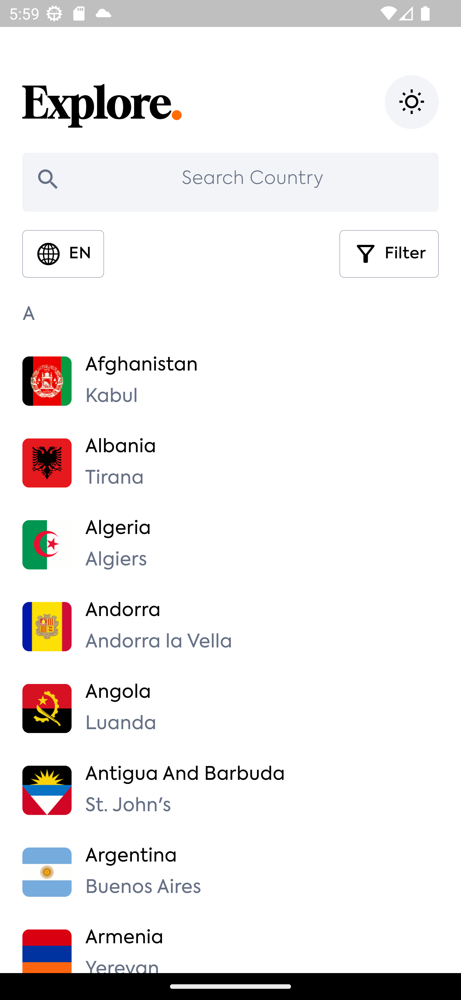
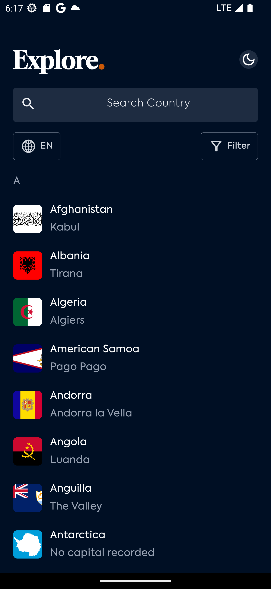
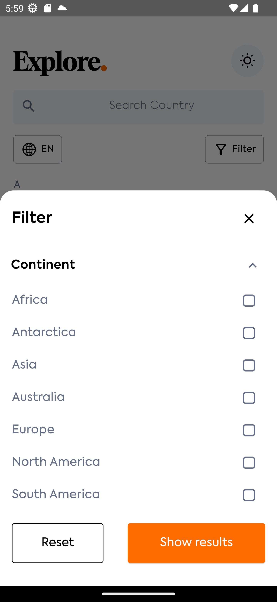
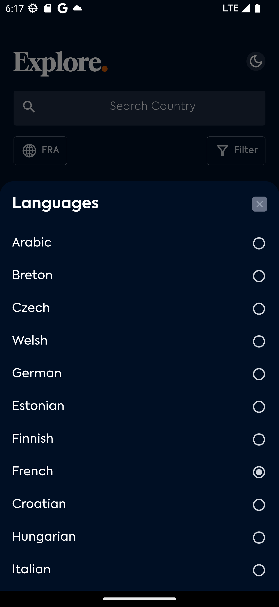
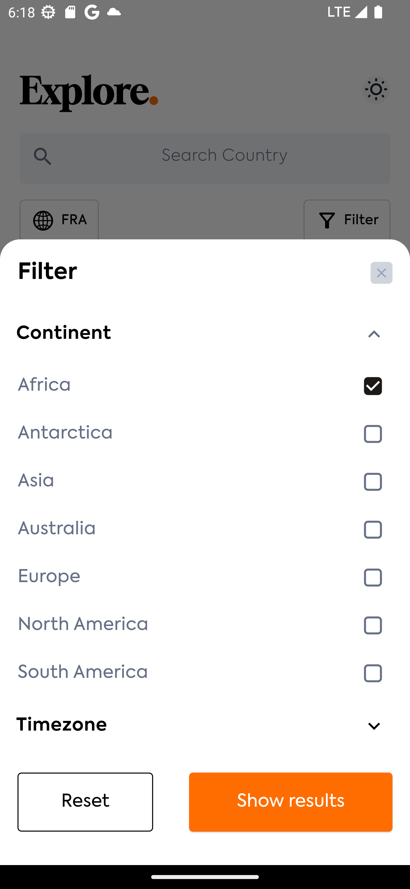
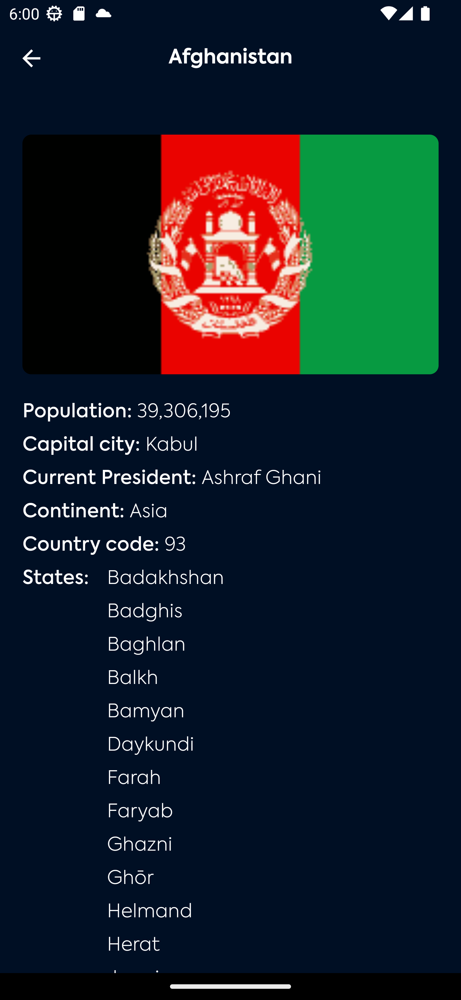

# HNG 2 Task

A Flutter mobile app that gives you the ability to view countries and their information.

### Possible information in country details

- Name
- States
- Flag
- Population
- Capital city
- Current president
- Continent
- Country code

## ✨ Features

- [x] Search for countries based on name
- [x] Filter countries based on continent

## 📸 ScreenShots

| Light                                        | Dark                                         |
| -------------------------------------------- | -------------------------------------------- |
|  |  |
|  |  |
|  |  |

## Dependencies used

- [**cupertino_icons**](https://pub.dev/packages/cupertino_icons) - iOS-style icons
- [**flutter_svg**](https://pub.dev/packages/flutter_svg) - SVG image rendering
- [**extended_image**](https://pub.dev/packages/extended_image) - Advanced image features
- [**fpdart**](https://pub.dev/packages/fpdart) - Functional programming utilities
- [**flutter_bloc**](https://pub.dev/packages/flutter_bloc) - App wide state management solution
- [**provider**](https://pub.dev/packages/provider) - State management solution for configuring App theme
- [**dio**](https://pub.dev/packages/dio) - HTTP client for API calls
- [**flutter_dotenv**](https://pub.dev/packages/flutter_dotenv) - Environment variables management
- [**google_fonts**](https://pub.dev/packages/google_fonts) - Custom fonts support
- [**equatable**](https://pub.dev/packages/equatable) - Simplified equality comparisons

## Setup

- Clone the repository

  ```bash
  git clone https://github.com/emeleonufavour/hng_mobile_tasks.git
  ```

- Navigate to project directory

  ```bash
  cd hng_mobile_tasks
  cd hng_2_task
  ```

- Install dependencies

  ```bash
  flutter pub get
  ```

## 🔑 Environment Variables

This project uses environment variables to store the API key. Follow the steps below to set up your `.env` file correctly.

### Create a `.env` file

In the root directory of the project, create a new file named `.env`. You can do this manually or run the following command:

```bash
touch .env
```

### Add the required API key

Visit https://restfulcountries.com/request-access-token to generate an API key

In the .env file, add your API key

```bash
API_KEY=your_api_key_here
```

### Run the app

```bash
flutter run
```

## Platform compability

- Android
- iOS

## Getting Started

This project is a starting point for a Flutter application.

A few resources to get you started if this is your first Flutter project:

- [Lab: Write your first Flutter app](https://docs.flutter.dev/get-started/codelab)
- [Cookbook: Useful Flutter samples](https://docs.flutter.dev/cookbook)

For help getting started with Flutter development, view the
[online documentation](https://docs.flutter.dev/), which offers tutorials,
samples, guidance on mobile development, and a full API reference.
